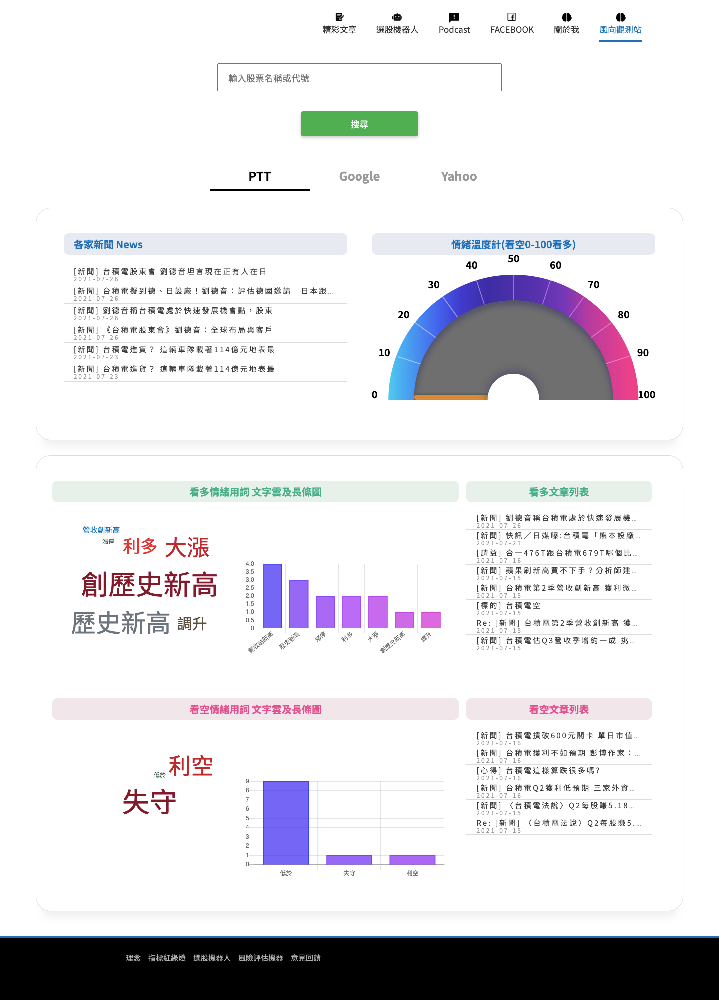
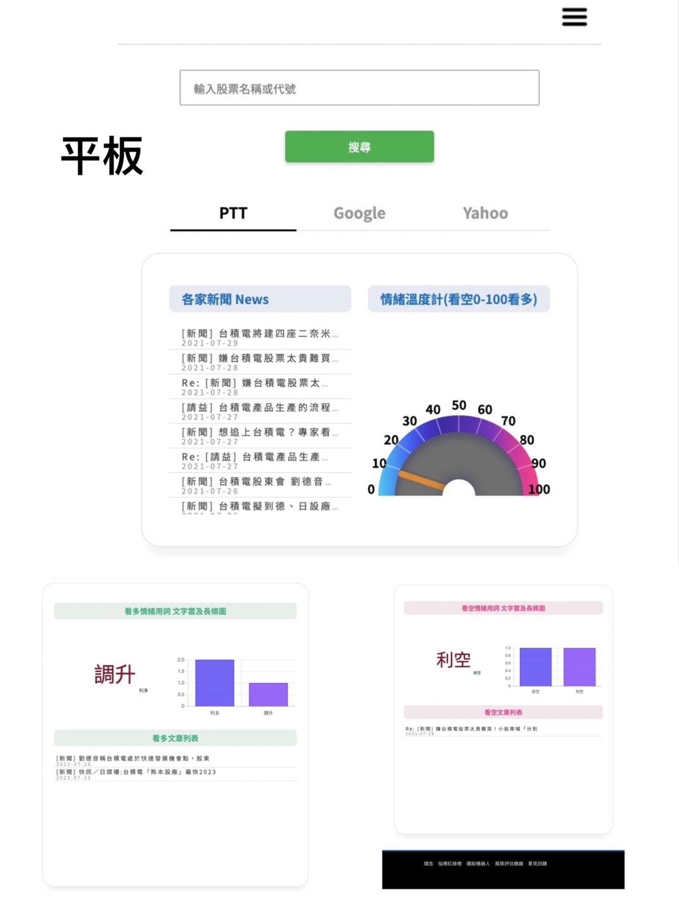
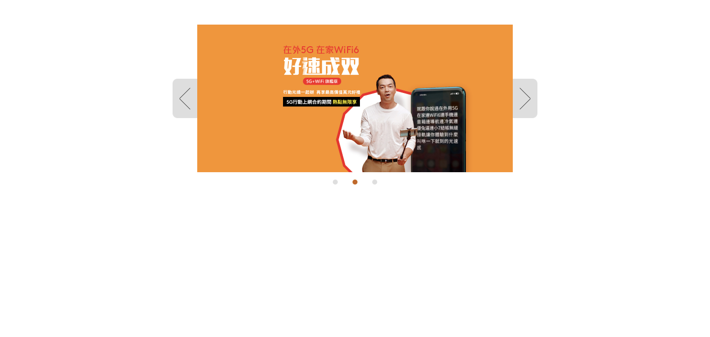
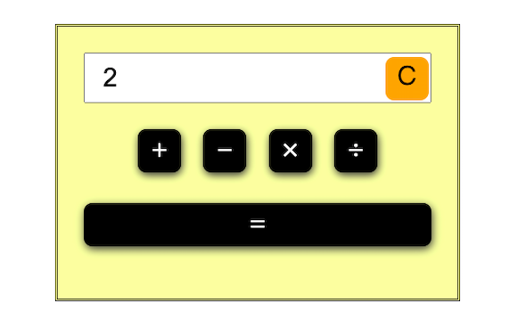

# 您好！我是周子平
這是我的 ➡ [作品集](#作品集) 

```json
{
  "results": [{
    "name": "周子平",
    "age": "26",
    "personality":"awesome",
    "intro":
    [{
      "content":"您好，我是周子平，雖然我非本科生也不是名門大學畢業，在因緣際會下認識到前端這份職業，我覺得非常有挑戰性，我喜歡學習新知，面對任何事我都會全力以赴，負責到底。",
      "index":"1"
    },
    {
      "content":" 目前自學前端相關技術已有5個月，學習期間接觸過兩個外包專案，並有和後端工程師溝通的經驗。",
      "index":"2"
    },
    {
      "content":" 精進自己的前端技術是我最想做的事情，下一步是將前端三本柱其中的vue做到精熟。",
      "index":"3"
    }],
    "link": "https://github.com/max8030396/maxCollection",
    "data":{
      "framework": "Vue 2.x",
      "javascript":
      [{
          "code":["ES5","ES6","jQuery","Pug"]
        },
        {
          "api":["axios","AJAX"]
        }],
      "style": ["Sass/Scss","Css","Bootstrap5"],
      "tool": ["Webpack4","Node.js","GitHub"]

    }
  }]
}
```
----
## 作品集 


* [後台專案](#後台專案)
* [網頁專案](#網頁專案)
* [superSliderPlugin](#自製圖片輪播套件) *自製圖片輪播套件*
* [左右閃躲小遊戲](#左右閃躲小遊戲)
* [計算機](#計算機)
* [➡ go github](https://github.com/max8030396/maxCollection "github")

#####  #後台專案
  
    自行設計編排整體呈現及rwd，運用axios串接大量的api及模組化概念
    並結合bootstrap5及webpack自動化打包流程等完成此次專案

---
1. [登入頁面](#登入頁面) 
2. [首頁](#首頁)
3. [會員資訊](#會員資訊)
4. [網路文章](#網路文章)
5. [會員卡](#會員卡)
6. [專欄](#專欄)
7. [編輯專欄](#編輯專欄)
8. [新增專欄：](#新增專欄)
9. [問答：](#問答)
10. [自動功能：](#自動功能)

######[⬆回到專案目錄](#作品集)

---
####  #登入頁面
透過串接api後端回傳資料，判斷登入許可


######[⬆回到專案](#後台專案)

---
####  #首頁


######[⬆回到專案](#後台專案)

---
####  #會員資訊
結合api達成顯示、搜尋、編輯及刪除等功能


######[⬆回到專案](#後台專案)

---
####  #網路文章
結合api串接達成顯示、搜尋


######[⬆回到專案](#後台專案)

---
####  #會員卡
結合api串接達成顯示、搜尋、編輯、新增及刪除等功能


######[⬆回到專案](#後台專案)

---
####  #專欄
結合api串接達成顯示、搜尋、編輯、新增及刪除等功能


######[⬆回到專案](#後台專案)

---
####  #編輯專欄


######[⬆回到專案](#後台專案)

---
####  #新增專欄


######[⬆回到專案](#後台專案)

---
####  #問答


######[⬆回到專案](#後台專案)

---
######[⬆回到專案](#後台專案)
####  #自動功能
結合api串接達成顯示及搜尋等功能


######[⬆回到專案](#後台專案)
######[⬆回到專案目錄](#作品集)
<<<<<<< HEAD

---

#####  #網頁專案
    自行設計編排整體呈現及rwd，與後端溝通api資料結構
    搭配jquery及chart.js，透過ajax串接api
    配合webpack自動化打包流程完成此專案




######[⬆回到專案](#網頁專案)
######[⬆回到專案目錄](#作品集)

----

#####  #自製圖片輪播套件
    使用javascript手刻一個自動圖片輪播套件
    客製化設定輪播速度及內含圖片量，顯示上也有設計rwd


######[⬆回到專案目錄](#作品集)

----

##### #左右閃躲小遊戲
> 鍵盤操控人物左右移動，分別低、中、高遊戲難度，在一分鐘內閃躲石塊取得分數
> 透過jQuery設計碰撞判斷及石磚隨機掉落，顯示上也有設計rwd


######[⬆回到專案](#左右閃躲小遊戲)
######[⬆回到專案目錄](#作品集)

----

##### 計算機
    簡單利用javascript設計計算機

######[⬆回到專案目錄](#作品集)

----
=======

---

#####  #網頁專案
    自行設計編排整體呈現及rwd，與後端溝通api資料結構
    搭配jquery及chart.js，透過ajax串接api
    配合webpack自動化打包流程完成此專案


######[⬆回到專案](#網頁專案)
######[⬆回到專案目錄](#作品集)

----

#####  #自製圖片輪播套件
    使用javascript手刻一個自動圖片輪播套件
    客製化設定輪播速度及內含圖片量，顯示上也有設計rwd


######[⬆回到專案目錄](#作品集)

----

##### #左右閃躲小遊戲
> 鍵盤操控人物左右移動，分別低、中、高遊戲難度，在一分鐘內閃躲石塊取得分數
> 透過jQuery設計碰撞判斷及石磚隨機掉落，顯示上也有設計rwd


######[⬆回到專案](#左右閃躲小遊戲)
######[⬆回到專案目錄](#作品集)

----

##### 計算機
    簡單利用javascript設計計算機

######[⬆回到專案目錄](#作品集)

----
>>>>>>> 46141c5277523312ca56a77319b1dfa110448271
